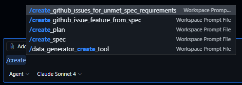

# Prompt Files (experimental)

This folder contains example prompt files (experimental) for GitHub Copilot. For more information on how to use these, see the [GitHub Copilot prompt files](https://code.visualstudio.com/docs/copilot/copilot-customization#_prompt-files-experimental).

## Prompt Files Index

A list of prompt files available in this repository:

| Name | Example File | Usage |
|------|--------------|-------|
| Create Architectural Decision Record | [create-architectural-decision-record.prompt.md](create-architectural-decision-record.prompt.md) | Create an Architectural Decision Record (ADR) document for AI-optimized decision documentation. |
| Create GitHub Issue from Specification | [create-github-issue-feature-from-specification.prompt.md](create-github-issue-feature-from-specification.prompt.md) | Create GitHub Issue for feature request from specification file using feature_request.yml template. |
| Create GitHub Issue from Implementation Plan | [create-github-issues-feature-from-implementation-plan.prompt.md](create-github-issues-feature-from-implementation-plan.prompt.md) | Create GitHub Issues from implementation plan phases using feature_request.yml or chore_request.yml templates. |
| Create GitHub Issues for Unmet Specification Requirements | [create-github-issues-for-unmet-specification-requirements.prompt.md](create-github-issues-for-unmet-specification-requirements.prompt.md) | Create GitHub Issues for unimplemented requirements from specification files using feature_request.yml template. |
| Create Implementation Plan | [create-implementation-plan.prompt.md](create-implementation-plan.prompt.md) | Create a new implementation plan file for new features, refactoring existing code or upgrading packages, design, architecture or infrastructure. |
| Create LLMs.txt File from Repository Structure | [create-llms.prompt.md](create-llms.prompt.md) | Create an llms.txt file from scratch based on repository structure following the llms.txt specification at https://llmstxt.org/ |
| Generate Standard OO Component Documentation | [create-oo-component-documentation.prompt.md](create-oo-component-documentation.prompt.md) | Create comprehensive, standardized documentation for object-oriented components following industry best practices and architectural documentation standards. |
| Create Specification | [create-specification.prompt.md](create-specification.prompt.md) | Create a new specification file for the solution, optimized for Generative AI consumption. |
| .NET/C# Best Practices | [dotnet-best-practices.prompt.md](dotnet-best-practices.prompt.md) | Ensure .NET/C# code meets best practices for the solution/project. |
| .NET/C# Design Pattern Review | [dotnet-design-pattern-review.prompt.md](dotnet-design-pattern-review.prompt.md) | Review the C#/.NET code for design pattern implementation and suggest improvements. |
| Suggest Awesome GitHub Copilot Chatmodes | [suggest-awesome-github-copilot-chatmodes.prompt.md](suggest-awesome-github-copilot-chatmodes.prompt.md) | Suggest relevant GitHub Copilot chatmode files from the awesome-copilot repository based on current repository context and chat history, avoiding duplicates with existing chatmodes in this repository. |
| Suggest Awesome GitHub Copilot Prompts | [suggest-awesome-github-copilot-prompts.prompt.md](suggest-awesome-github-copilot-prompts.prompt.md) | Suggest relevant GitHub Copilot prompt files from the awesome-copilot repository based on current repository context and chat history, avoiding duplicates with existing prompts in this repository. |
| Suggest GitHub Copilot Chatmodes | [suggest-github-copilot-chatmodes.prompt.md](suggest-github-copilot-chatmodes.prompt.md) | Suggest relevant GitHub Copilot chatmode files from a GitHub repository based on current repository context and chat history, avoiding duplicates with existing chatmodes in this repository. |
| Suggest GitHub Copilot Prompts | [suggest-github-copilot-prompts.prompt.md](suggest-github-copilot-prompts.prompt.md) | Suggest relevant GitHub Copilot prompt files from a GitHub repository based on current repository context and chat history, avoiding duplicates with existing prompts in this repository. |
| Update Azure Verified Modules in Bicep Files | [update-avm-modules-in-bicep.prompt.md](update-avm-modules-in-bicep.prompt.md) | Update Azure Verified Modules (AVM) to latest versions in Bicep files. |
| Implementation Plan Update | [update-implementation-plan.prompt.md](update-implementation-plan.prompt.md) | Update an existing implementation plan file with new or update requirements to provide new features, refactoring existing code or upgrading packages, design, architecture or infrastructure. |
| Update LLMs.txt File | [update-llms.prompt.md](update-llms.prompt.md) | Update the llms.txt file in the root folder to reflect changes in documentation or specifications following the llms.txt specification at https://llmstxt.org/ |
| Update Markdown File Index | [update-markdown-file-index.prompt.md](update-markdown-file-index.prompt.md) | Update a markdown file section with an index/table of files from a specified folder. |
| Update Standard OO Component Documentation | [update-oo-component-documentation.prompt.md](update-oo-component-documentation.prompt.md) | Update existing object-oriented component documentation following industry best practices and architectural documentation standards. |
| Update Specification | [update-specification.prompt.md](update-specification.prompt.md) | Update an existing specification file for the solution, optimized for Generative AI consumption based on new requirements or updates to any existing code. |

## Usage

To use these prompt files:

1. Copy the desired `.prompt.md` file from this folder to your VS Code user settings folder or workspace `.github/prompts` folder
1. Access the prompt file through the chat interface in VS Code by typing `/` and selecting the prompt from the list

    